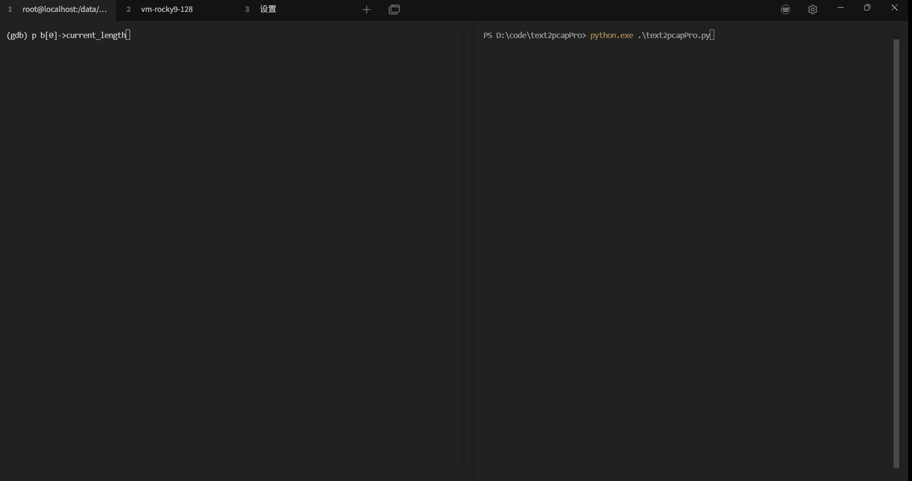
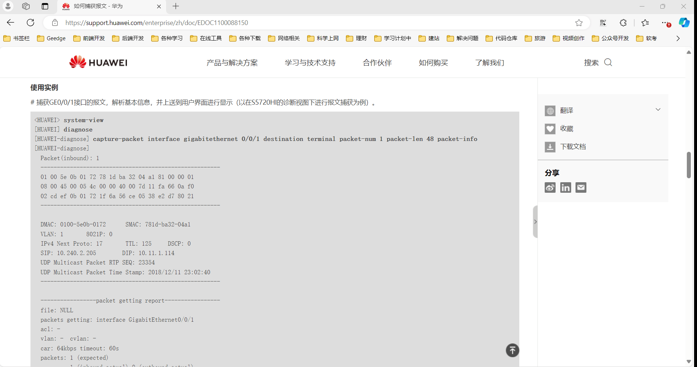
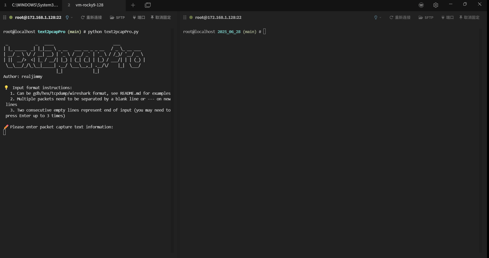
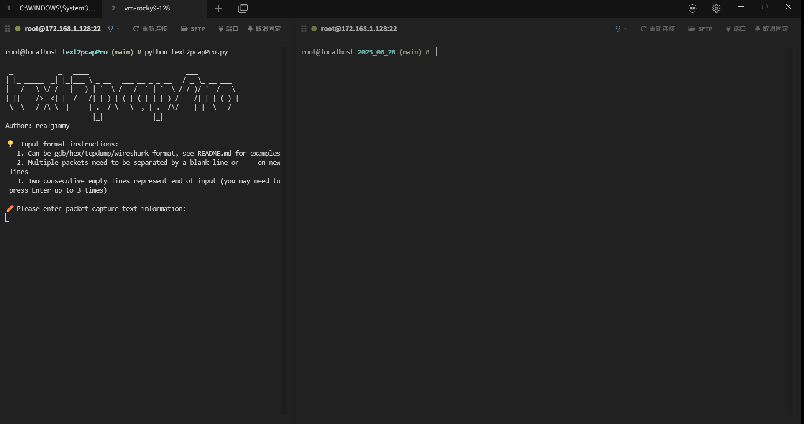
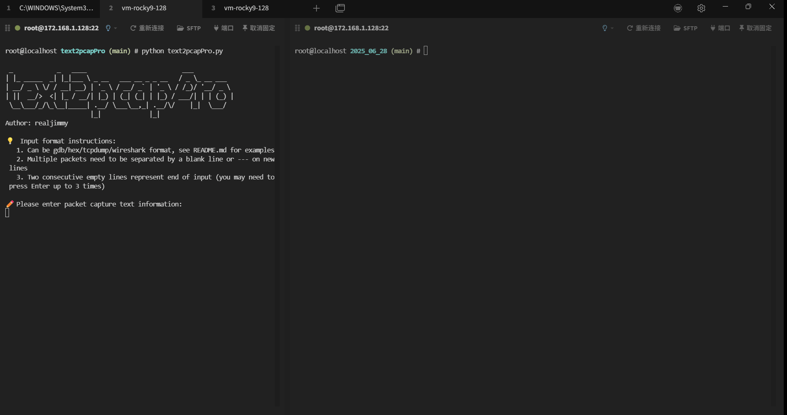

# text2pcapPro - Text to pcap Tool

[中文](README_CN.md)
[English](README.md)

- [text2pcapPro - Text to pcap Tool](#text2pcappro---text-to-pcap-tool)
  - [Introduction](#introduction)
  - [How it Works](#how-it-works)
  - [Usage Scenarios](#usage-scenarios)
    - [1. GDB Debugging](#1-gdb-debugging)
    - [2. Log Files](#2-log-files)
    - [3. tcpdump Output](#3-tcpdump-output)
    - [4. Wireshark Format](#4-wireshark-format)
  - [Requirements](#requirements)
    - [System Dependencies](#system-dependencies)
    - [Install Python](#install-python)
    - [Install text2pcap](#install-text2pcap)
  - [Usage](#usage)
    - [Interactive Input Mode](#interactive-input-mode)
    - [File Input Mode](#file-input-mode)
    - [Configuration File](#configuration-file)
      - [Linux](#linux)
      - [Windows](#windows)
    - [Multiple Packet Input](#multiple-packet-input)
      - [General Multi-packet Separator](#general-multi-packet-separator)
      - [tcpdump-specific Multi-packet Separator](#tcpdump-specific-multi-packet-separator)
    - [Keep Intermediate File (Wireshark-compatible text format)](#keep-intermediate-file-wireshark-compatible-text-format)
    - [Output Files](#output-files)
  - [Common Errors](#common-errors)

## Introduction

text2pcapPro is a tool for converting textual packet data into pcap format. The text data may come from gdb output, debug logs, tcpdump, or network device debug commands. The tool can automatically detect the input format and convert it, finally generating a pcap file.

## How it Works

Wireshark provides the text2pcap tool to convert text to pcap, but it requires a strict text format. For example, the standard format supported by Wireshark is:

```text
0000   11 22 33 44 55 66 00 50 56 c0 00 01 08 00 45 00 
0010   00 3c 1d 8d 00 00 40 01 db 6a c0 a8 80 01 c0 a8 
0020   80 77 08 00 10 94 00 01 3c c7 61 62 63 64 65 66 
0030   67 68 69 6a 6b 6c 6d 6e 6f 70 71 72 73 74 75 76 
0040   77 61 62 63 64 65 66 67 68 69 
```

However, in real scenarios, the text format is often inconsistent and not aligned, making debugging inconvenient. text2pcapPro is built on top of Wireshark's text2pcap, automatically formatting various text styles into the format supported by text2pcap, and then converting to pcap.

**Features:**

- **Multi-format Support:** Automatically detects and supports GDB, Hex, TCPdump, Huawei debug command, and Wireshark standard format (see examples below).
- **Output Format:** Can output pcap format and Wireshark-compatible text format.
- **Input Modes:** Supports file input and interactive input.

## Usage Scenarios

When you have packet data in text format (e.g., gdb debug info, log files, tcpdump output pasted in issues), and you want to analyze it visually in Wireshark but don't want to manually reformat the text, this tool is perfect for you.

### 1. GDB Debugging

You can break at the desired point in your program, print the packet data in hex, and use this tool to convert it to a pcap file. For example, if the packet is 74 bytes and stored in a variable `data`, run `x/74bx data` in gdb to get:

```bash
0x1004fa300:    0x11    0x22    0x33    0x44    0x55    0x66    0x00    0x50
0x1004fa308:    0x56    0xc0    0x00    0x01    0x08    0x00    0x45    0x00
0x1004fa310:    0x00    0x3c    0x1d    0x8d    0x00    0x00    0x40    0x01
0x1004fa318:    0xdb    0x6a    0xc0    0xa8    0x80    0x01    0xc0    0xa8
0x1004fa320:    0x80    0x77    0x08    0x00    0x10    0x94    0x00    0x01
0x1004fa328:    0x3c    0xc7    0x61    0x62    0x63    0x64    0x65    0x66
0x1004fa330:    0x67    0x68    0x69    0x6a    0x6b    0x6c    0x6d    0x6e
0x1004fa338:    0x6f    0x70    0x71    0x72    0x73    0x74    0x75    0x76
0x1004fa340:    0x77    0x61    0x62    0x63    0x64    0x65    0x66    0x67
0x1004fa348:    0x68    0x69
```



### 2. Log Files

You may log packet data in hex, for example from production environments or network devices like Huawei's capture-packet command. The log can be any line length, as long as bytes are separated by spaces:

```text
11 22 33 44 55 66 00 50 56 c0 00 01 08 00 45 00
00 3c 1d 8d 00 00 40 01 db 6a c0 a8 80 01 c0 a8
80 77 08 00 10 94 00 01 3c c7 61 62 63 64 65 66
67 68 69 6a 6b 6c 6d 6e 6f 70 71 72 73 74 75 76
77 61 62 63 64 65 66 67 68 69
```




### 3. tcpdump Output

If you use tcpdump but cannot transfer the pcap file (e.g., due to firewall or compliance), or you only have text output, this tool is helpful. Use `tcpdump -i ens160 -s 0 -tt -xx` to get output like:

```text
0x0000:  000c 2947 3846 0050 56c0 0008 0800 4500
0x0010:  0028 4cd4 4000 8006 997b 0a00 0001 0a00
0x0020:  0080 c5db 0016 46e3 f833 f77d a0e5 5010
0x0030:  1004 ede3 0000 0000 0000 0000
```


### 4. Wireshark Format

This format can be directly imported into Wireshark. This project also supports input in this standard format:

```text
0000   11 22 33 44 55 66 00 50 56 c0 00 01 08 00 45 00 
0010   00 3c 1d 8d 00 00 40 01 db 6a c0 a8 80 01 c0 a8 
0020   80 77 08 00 10 94 00 01 3c c7 61 62 63 64 65 66 
0030   67 68 69 6a 6b 6c 6d 6e 6f 70 71 72 73 74 75 76 
0040   77 61 62 63 64 65 66 67 68 69 
```



## Requirements

Supports Windows, Linux, and Mac.

### System Dependencies

- Python 3
- text2pcap (Wireshark component)

### Install Python

(Skip, as Python installation is standard)

### Install text2pcap

```bash
# Ubuntu/Debian
sudo apt-get install wireshark-common

# CentOS/RHEL
sudo yum install wireshark

# macOS
brew install wireshark

# Windows
download and install from: https://www.wireshark.org/
```

## Usage

### Interactive Input Mode

```bash
python3 text2pcapPro.py
```

Paste the text directly. Two blank lines indicate the end of input, so you may need to press Enter up to three times to finish.

### File Input Mode

```bash
python3 text2pcapPro.py -r input.txt
```

Read data from the specified file for conversion. Example files can be found in `unittest/ok_case`. Lines starting with `#` are treated as comments and ignored.

### Configuration File

Location: `config/settings.ini`, mainly used to store the path to the text2pcap dependency. If the config file does not exist, it will be created automatically and `text2pcap -v` will be executed to test validity. If your command line can recognize text2pcap, you don't need to worry about this config. If not (common on Windows), you need to manually enter the directory or full path to text2pcap.

#### Linux

After installing Wireshark, text2pcap is usually at `/usr/bin/text2pcap` and in the PATH, so no extra setup is needed.

#### Windows

After installing Wireshark, text2pcap is in the Wireshark directory. Enter the Wireshark install path:

```bash
Please enter the directory containing text2pcap, or the full path to text2pcap: C:\Program Files\Wireshark\
✅ Dependency program text2pcap path verification passed
✅ Updated text2pcap path to: C:\Program Files\Wireshark\text2pcap
```


### Multiple Packet Input

#### General Multi-packet Separator

When input contains multiple packets, use a blank line or at least three dashes (`---`) as a separator. For example, the following will generate a pcap file with 3 packets:

```text
11 22 33 44 55 66 00 50 56 c0 00 01 08 00 45 00
00 3c 1d 8d 00 00 40 01 db 6a c0 a8 80 01 c0 a8
80 77 08 00 10 94 00 01 3c c7 61 62 63 64 65 66
67 68 69 6a 6b 6c 6d 6e 6f 70 71 72 73 74 75 76
77 61 62 63 64 65 66 67 68 69

11 22 33 44 55 66 00 50 56 c0 00 01 08 00 45 00
00 3c 1d 8d 00 00 40 01 db 6a c0 a8 80 01 c0 a8
80 77 08 00 10 94 00 01 3c c7 61 62 63 64 65 66
67 68 69 6a 6b 6c 6d 6e 6f 70 71 72 73 74 75 76
77 61 62 63 64 65 66 67 68 69
---
11 22 33 44 55 66 00 50 56 c0 00 01 08 00 45 00
00 3c 1d 8d 00 00 40 01 db 6a c0 a8 80 01 c0 a8
80 77 08 00 10 94 00 01 3c c7 61 62 63 64 65 66
67 68 69 6a 6b 6c 6d 6e 6f 70 71 72 73 74 75 76
77 61 62 63 64 65 66 67 68 69
```



#### tcpdump-specific Multi-packet Separator

For tcpdump, if a line contains the character `>`, it is treated as a packet separator, equivalent to `---` or a blank line. For example:

```bash
1751013131.855806 ens160 In  IP 10.0.0.1.50651 > localhost.localdomain.ssh: Flags [.], ack 1235348, win 4095, length 0
        0x0000:  0800 0000 0000 0002 0001 0006 0050 56c0
        0x0010:  0008 0000 4500 0028 0674 4000 8006 dfdb
        0x0020:  0a00 0001 0a00 0080 c5db 0016 46e5 0e6f
        0x0030:  f7b1 2699 5010 0fff 51c4 0000 0000 0000
        0x0040:  0000
1751013131.855806 ens160 In  IP 10.0.0.1.50651 > localhost.localdomain.ssh: Flags [.], ack 1235348, win 4095, length 0
        0x0000:  0800 0000 0000 0002 0001 0006 0050 56c0
        0x0010:  0008 0000 4500 0028 0674 4000 8006 dfdb
        0x0020:  0a00 0001 0a00 0080 c5db 0016 46e5 0e6f
        0x0030:  f7b1 2699 5010 0fff 51c4 0000 0000 0000
        0x0040:  0000
```



### Keep Intermediate File (Wireshark-compatible text format)

```bash
python3 text2pcapPro.py -k
```

By default, the tool deletes the intermediate file. Use this option to keep it for verification.

### Output Files

- Output directory: `output/YYYY_MM_DD/`
- File format: `NN_pcap.pcap` and `NN_pcap.txt`

## Common Errors

- **Invalid path:** text2pcap program path is incorrect. Please ensure Wireshark is installed and the path is set correctly.
- **Format detection failed:** Only the formats described above are supported. If you need more, please open an issue with your scenario and sample.
- **Non-hex content:** The packet must be in hexadecimal format. Invalid content will cause an error.
- **File permission error:** Cannot read or write file.
