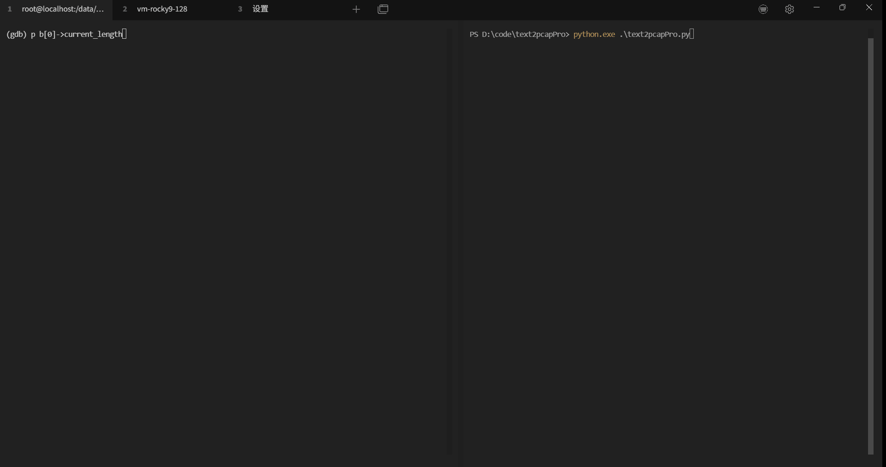
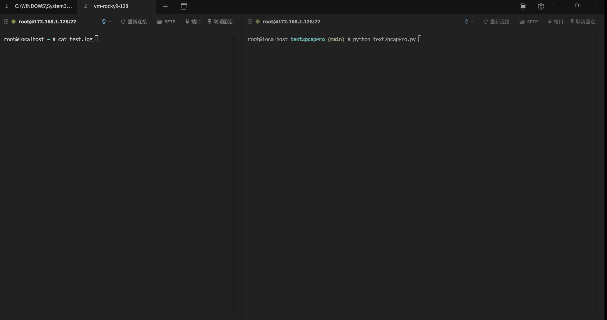
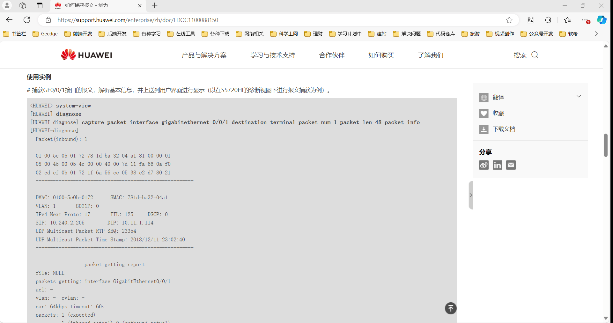
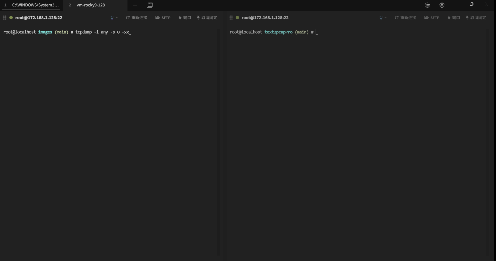
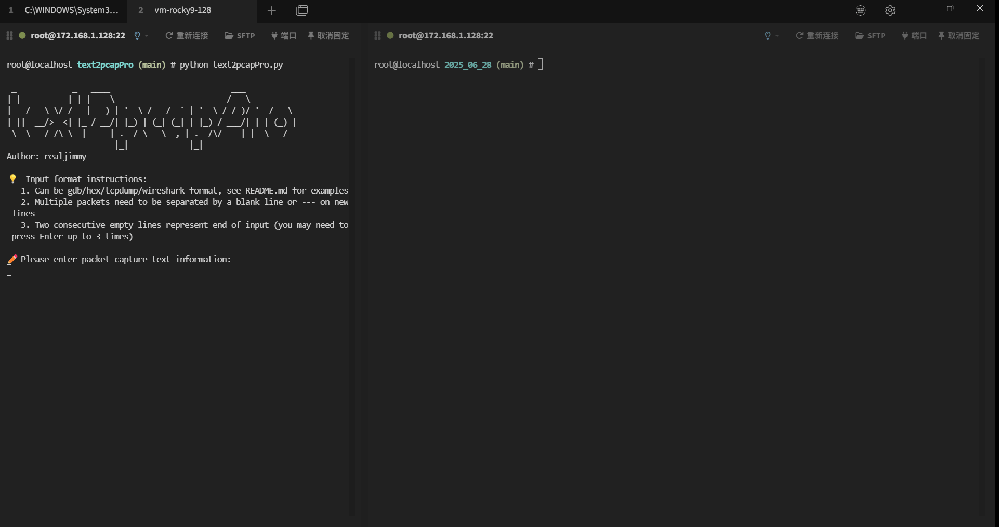
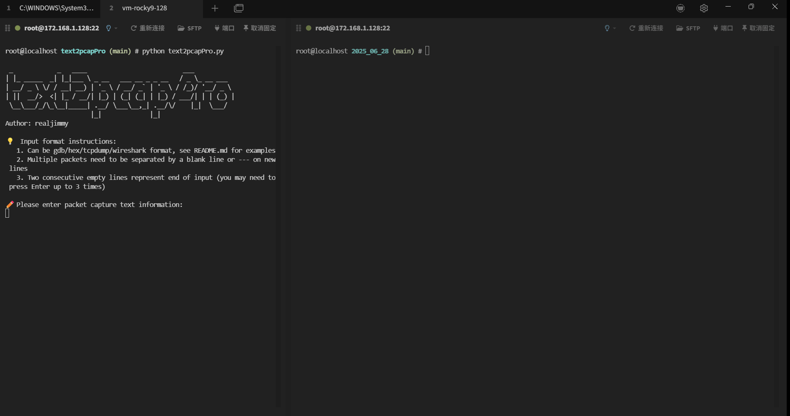
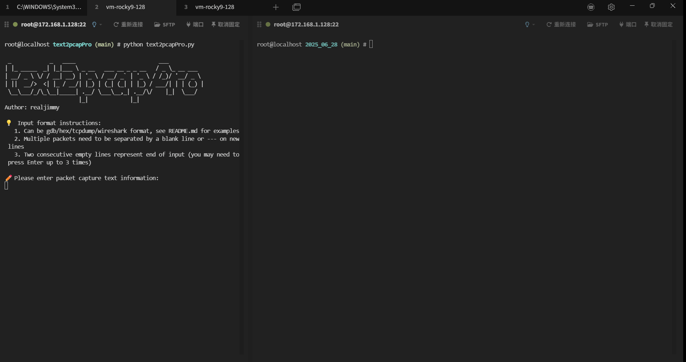

# text2pcapPro - 文本转pcap工具

[中文](README_CN.md)
[English](README.md)

- [text2pcapPro - 文本转pcap工具](#text2pcappro---文本转pcap工具)
  - [简介](#简介)
  - [它是怎么工作的](#它是怎么工作的)
  - [使用场景](#使用场景)
    - [1. gdb调试](#1-gdb调试)
    - [2. log日志](#2-log日志)
    - [3. tcpdump日志](#3-tcpdump日志)
    - [4. wireshark格式](#4-wireshark格式)
  - [安装要求](#安装要求)
    - [系统依赖](#系统依赖)
    - [安装 python](#安装-python)
    - [安装 text2pcap](#安装-text2pcap)
  - [使用方法](#使用方法)
    - [交互式输入模式](#交互式输入模式)
    - [文件输入模式](#文件输入模式)
    - [配置文件](#配置文件)
      - [Linux环境](#linux环境)
      - [Windows环境](#windows环境)
    - [一次输入多个数据包](#一次输入多个数据包)
      - [通用的多包分隔符](#通用的多包分隔符)
      - [tcpdump独有的多包分隔符](#tcpdump独有的多包分隔符)
    - [保留中间文件（wireshark支持的标准文本格式）](#保留中间文件wireshark支持的标准文本格式)
    - [输出文件](#输出文件)
  - [常见错误说明](#常见错误说明)

## 简介

text2pcapPro是一个用于将数据包文字信息转换为pcap数据包格式的工具，这些文字信息可能来自gdb打印、调试日志、tcpdump输出、网络设备debug命令等。该工具能够自动识别输入的格式并进行转换，最终生成pcap文件。

## 它是怎么工作的

wireshark提供了text2pcap工具用于将文本转换为pcap文件，但是对文本格式有严格要求，以下为wireshark支持的标准格式：

```text
0000   11 22 33 44 55 66 00 50 56 c0 00 01 08 00 45 00 
0010   00 3c 1d 8d 00 00 40 01 db 6a c0 a8 80 01 c0 a8 
0020   80 77 08 00 10 94 00 01 3c c7 61 62 63 64 65 66 
0030   67 68 69 6a 6b 6c 6d 6e 6f 70 71 72 73 74 75 76 
0040   77 61 62 63 64 65 66 67 68 69 
```

而我们在实际使用中，拿到的文字格式是多种多样的，甚至对齐都是参差不齐的，这为我调试带来了不少障碍，因为我不得不做一次格式转换。
因此text2pcapPro就诞生了，该工具底层基于wireshark提供的text2pcap工具，上层将各种格式的文字格式化为text2pcap支持的格式，最终转换为pcap文件。

功能特性如下：

- **多格式支持**：自动识别 GDB、Hex、TCPdump、华为debug命令、Wireshark标准格式（下文有详细示例）。
- **输出格式**：可输出pcap格式，以及wireshark支持的文本格式。
- **输入模式**：支持文件输入，以及交互式输入。

## 使用场景

当你拿到的数据包是文字格式，比如gdb调试信息，log日志，tcpdump输出信息（测试人员贴在issue中），
而你需要使用wireshark等工具更直观地分析问题，但又不想费劲的将文字转换为wireshark支持的标准格式，这款工具就非常适合你。

### 1. gdb调试

你可以将程序断在需要调试的位置，根据数据包长度，将数据包以十六进制打印出来，并使用该工具转为pcap包。假设数据包长度为74字节，存储数据包的变量为data，你需要在gdb中执行`x/74bx data`，得到以下输出，将其输入到text2pcapPro里。

```bash
0x1004fa300:    0x11    0x22    0x33    0x44    0x55    0x66    0x00    0x50
0x1004fa308:    0x56    0xc0    0x00    0x01    0x08    0x00    0x45    0x00
0x1004fa310:    0x00    0x3c    0x1d    0x8d    0x00    0x00    0x40    0x01
0x1004fa318:    0xdb    0x6a    0xc0    0xa8    0x80    0x01    0xc0    0xa8
0x1004fa320:    0x80    0x77    0x08    0x00    0x10    0x94    0x00    0x01
0x1004fa328:    0x3c    0xc7    0x61    0x62    0x63    0x64    0x65    0x66
0x1004fa330:    0x67    0x68    0x69    0x6a    0x6b    0x6c    0x6d    0x6e
0x1004fa338:    0x6f    0x70    0x71    0x72    0x73    0x74    0x75    0x76
0x1004fa340:    0x77    0x61    0x62    0x63    0x64    0x65    0x66    0x67
0x1004fa348:    0x68    0x69
```

windows环境下gdb输出转pcap演示


### 2. log日志

可能出现在：

- 现网环境很少能有gdb调试环境，因此你可能会将数据包内容写入日志。
- 主流网络设备比如华为capture-packet命令输出的日志。

以下是一个日志的例子，实际应用中你可以更随意的输出日志，不用局限每行多少个字节，但必须得是以空格隔开的十六进制。

```text
11 22 33 44 55 66 00 50 56 c0 00 01 08 00 45 00
00 3c 1d 8d 00 00 40 01 db 6a c0 a8 80 01 c0 a8
80 77 08 00 10 94 00 01 3c c7 61 62 63 64 65 66
67 68 69 6a 6b 6c 6d 6e 6f 70 71 72 73 74 75 76
77 61 62 63 64 65 66 67 68 69
```

Linux环境下hex日志转pcap演示


华为capture-packet输出转pcap演示


### 3. tcpdump日志

如果你正在使用tcpdump抓包，但是由于各种原因（比如没有sz命令、防火墙拦截、合规问题的限制），无法将pcap文件传回本地，再或者你拿到的是测试人员贴在issue中的文字信息，已经没有现场抓包环境，本工具就派上用场了。需要注意的是，tcpdump抓包时需要添加-xx参数，如：`tcpdump -i ens160 -s 0 -tt -xx`，得到以下输出示例：

```text
0x0000:  000c 2947 3846 0050 56c0 0008 0800 4500
0x0010:  0028 4cd4 4000 8006 997b 0a00 0001 0a00
0x0020:  0080 c5db 0016 46e3 f833 f77d a0e5 5010
0x0030:  1004 ede3 0000 0000 0000 0000
```

Linux环境下tcpdump日志转pcap演示


### 4. wireshark格式

这种格式可以直接通过wireshark导入，这里也支持这种标准格式作为输入。

```text
0000   11 22 33 44 55 66 00 50 56 c0 00 01 08 00 45 00 
0010   00 3c 1d 8d 00 00 40 01 db 6a c0 a8 80 01 c0 a8 
0020   80 77 08 00 10 94 00 01 3c c7 61 62 63 64 65 66 
0030   67 68 69 6a 6b 6c 6d 6e 6f 70 71 72 73 74 75 76 
0040   77 61 62 63 64 65 66 67 68 69 
```

Linux环境下wireshark标准格式转pcap演示


## 安装要求

支持Windows、Linux、Mac环境

### 系统依赖

- Python 3
- text2pcap（Wireshark 组件）

### 安装 python

略

### 安装 text2pcap

```bash
# Ubuntu/Debian
sudo apt-get install wireshark-common

# CentOS/RHEL
sudo yum install wireshark

# macOS
brew install wireshark

# windows
从官网下载并安装wireshark：https://www.wireshark.org/
```

## 使用方法

### 交互式输入模式

```bash
python3 text2pcapPro.py
```

直接粘贴文字即可，2个空行代表输入结束，因此如果你要结束输入，需要输入最多3个回车键。

### 文件输入模式

```bash
python3 text2pcapPro.py -r input.txt
```

从指定文件读取数据进行转换，你可以在unittest/ok_case里找到文件示例。注，以 `#` 开头的行会被识别为注释内容，自动忽略。

### 配置文件

位置：`config/settings.ini`，主要用于存储依赖`text2pcap`的路径，如果配置文件不存在会自动创建，并尝试执行`text2pcap -v`测试有效性。如果你的命令行能够识别text2pcap则无需关注该配置，如果无法找到（windows环境大概率识别不了），需要你手动输入text2pcap所在目录（或者是完整路径）。

#### Linux环境

wireshark安装好后，text2pcap路径大概率为/usr/bin/text2pcap，这个路径在环境变量里，一般不需要再额外设置。

#### Windows环境

wireshark安装好后，text2pcap在wireshark所在目录下，因此输入wireshark安装路径即可：

```bash
Please enter the directory containing text2pcap, or the full path to text2pcap: C:\Program Files\Wireshark\
✅ Dependency program text2pcap path verification passed
✅ Updated text2pcap path to: C:\Program Files\Wireshark\text2pcap
```


### 一次输入多个数据包

#### 通用的多包分隔符

当你输入包含多个数据包时，可以使用`空行`，或是至少三个减号作为分隔符`---`，如下示例生成的pcap文件里将包含3个数据包：

```text
11 22 33 44 55 66 00 50 56 c0 00 01 08 00 45 00
00 3c 1d 8d 00 00 40 01 db 6a c0 a8 80 01 c0 a8
80 77 08 00 10 94 00 01 3c c7 61 62 63 64 65 66
67 68 69 6a 6b 6c 6d 6e 6f 70 71 72 73 74 75 76
77 61 62 63 64 65 66 67 68 69

11 22 33 44 55 66 00 50 56 c0 00 01 08 00 45 00
00 3c 1d 8d 00 00 40 01 db 6a c0 a8 80 01 c0 a8
80 77 08 00 10 94 00 01 3c c7 61 62 63 64 65 66
67 68 69 6a 6b 6c 6d 6e 6f 70 71 72 73 74 75 76
77 61 62 63 64 65 66 67 68 69
---
11 22 33 44 55 66 00 50 56 c0 00 01 08 00 45 00
00 3c 1d 8d 00 00 40 01 db 6a c0 a8 80 01 c0 a8
80 77 08 00 10 94 00 01 3c c7 61 62 63 64 65 66
67 68 69 6a 6b 6c 6d 6e 6f 70 71 72 73 74 75 76
77 61 62 63 64 65 66 67 68 69
```

Linux环境下通用多包转pcap演示：


#### tcpdump独有的多包分隔符

对于tcpdump一般都是多个包一起输出，因此该工具识别如果某行出现了 `>` 符号，则认为是分割符，等同于`---`或`空行`，例如：

```bash
1751013131.855806 ens160 In  IP 10.0.0.1.50651 > localhost.localdomain.ssh: Flags [.], ack 1235348, win 4095, length 0
        0x0000:  0800 0000 0000 0002 0001 0006 0050 56c0
        0x0010:  0008 0000 4500 0028 0674 4000 8006 dfdb
        0x0020:  0a00 0001 0a00 0080 c5db 0016 46e5 0e6f
        0x0030:  f7b1 2699 5010 0fff 51c4 0000 0000 0000
        0x0040:  0000
1751013131.855806 ens160 In  IP 10.0.0.1.50651 > localhost.localdomain.ssh: Flags [.], ack 1235348, win 4095, length 0
        0x0000:  0800 0000 0000 0002 0001 0006 0050 56c0
        0x0010:  0008 0000 4500 0028 0674 4000 8006 dfdb
        0x0020:  0a00 0001 0a00 0080 c5db 0016 46e5 0e6f
        0x0030:  f7b1 2699 5010 0fff 51c4 0000 0000 0000
        0x0040:  0000
```

Linux环境下tcpdump多包转pcap演示：


### 保留中间文件（wireshark支持的标准文本格式）

```bash
python3 text2pcapPro.py -k
```

默认情况下，该工具会删除中间文件，为了验证格式转换是否正确，可以使用该选项来保留中间文件。

### 输出文件

- 输出目录：`output/YYYY_MM_DD/`
- 文件格式：`NN_pcap.pcap`和`NN_pcap.txt` 

## 常见错误说明

- **路径无效**：text2pcap程序路径错误，请确保wireshark已正确安装，并指定了正确路径。
- **格式识别失败**：目前仅支持本文提到的几种格式，如果有格式需求请在issue里描述使用场景和样式。
- **非十六进制内容**：数据包要求是十六进制的格式，如果出现非法内容则会报错。
- **文件权限错误**：无法读取或写入文件。
 
